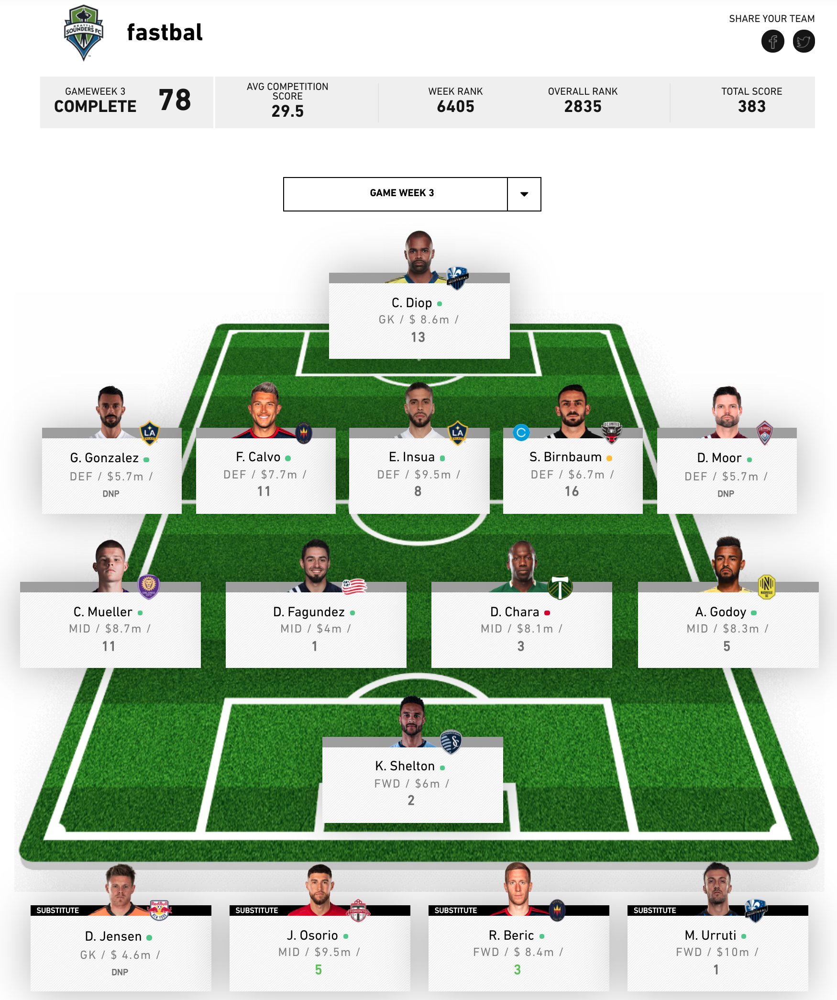

# fastbal -> FAntasy Soccer Team By ALgorithm
Using machine learning and linear programming to choose an MLS Fantasy soccer team.

## This project includes the following sections:

  * [Overview](#overview)
  * [Data Collection](#data-collection)
  * [Data transformation for use in modeling](#data-transforms)
  * [Modeling and cross validation](#modeling-and-cross-validation)
  * [Linear Programming to guide team selection based on model predictions](#linear-programming)
  * [Acknowledgements](#acknowledgments)

## Overview

Fantasy sports are a common manner for casual (or not so - some people can take it 
very seriously, and wager hundreds or even thousands of dollars in private leagues)
fans of a sport to participate alongside the sport in question. Participants will
join a league, and through various rules, construct teams of players in that league,
and earn points based on the specific rules for the fantasy league. Fantasy Football
and Fantasy Baseball are probably the largest fantasy leagues in the US.

For several years, I have played in fantasy soccer leagues, in both the English Premier
League, and here in the US with Major League Soccer (MLS). I was spending many hours
each week trying to choose a team, and decided to build a model to automate that process.

MLS Fantasy Soccer [rules](https://fantasy.mlssoccer.com/#help/game-rules) detail everyting
from selecting a team, to constraints for composition of the team (ie salary, number of players by
position, etc), and dates for each round of the season. Each player is assigned an MLS
team, a position, and a salary. Key constraints for constructing a team are:

  * Each team must have 11 starters and 4 subs
  * A team must have 1 goalie that starts, and 1 goalie sub
  * A team must have 5 defenders, of which between 3 and 5 start each week
  * A team must have 5 midfielders, of which between 3 and 5 start each week
  * A team must have 3 forwards, of which between 1 and 3 start each weak
  * The salary of the 15 players must be less than or equal to $125 million
  * Each fantasy team must have a mix of players, such that no more than 3 players
  come from any single MLS team.

For each game week, each player accrues stats in 25 categories, most of which add points
to a players weekly total (goals, passes, blocks, etc), and a few of which subtract
points (goals allowed, yellow cards, red cards). The total points for each player
is tallied each week, and the sum of all the starters is what determines the fantasy
team's point total.

## Data Collection

Once an account has been created, training data and target data can be collected by 
scraping data from the [MLS Fantasy Soccer](https://fantasy.mlssoccer.com) website.

First a player list of ids can be constructed with the following steps:

```
import player_ids as pi
import player_data_scraper as pds

login, pwd = 'your_mls_fantasy_login', 'your_fantasy_password'
driver = pi.mls_fantasy_login(login, pwd)
player_list = pi.get_player_ids_listform(driver)
```

As of August 2020, there is a quirk that Miguel Ibarra (who doesn't play much, which is
a bummer because he's a great player and I'm a Sounders fan) has some data that
is not inputted properly on the MLS Fantasy stats pages. For the scraper to work properly,
I remove him from the player list to continue.

Each player is a list of strings in the format `id, name, team`, so the following script
will remove him from the variable `player_list`:

```
for idx, player in player_list:
    if "Ibarra" in player[1]:
        ibarra = idx
player_list.pop(ibarra)
```

After which, to scrape the website, the following will script will scrape the meta data,
top level data, and season stats for each player for weeks 1 through 5 in this example:

```
meta, top, weekly = pds.cycle_all_player_ids(driver, player_list, 1, 5)
```

Feel free to store the data any way you prefer. The `player_data_scraper` file has 
the column headers as the global variables: `TOP_STATS_COLUMNS`, `SEASON_STATS_COLUMNS`,
`META_STATS_COLUMNS` available with the respective columns.

## Data Transforms

## Modeling and Cross Validation

## Linear Programming



## Acknowledgments

I leaned heavily on a [blog post](https://medium.com/ml-everything/using-python-and-linear-programming-to-optimize-fantasy-football-picks-dc9d1229db81) by [Branko Blagojevic](https://github.com/breeko) and the [Blending Problem](https://coin-or.github.io/pulp/CaseStudies/a_blending_problem.html) case study in the [PuLP Library](https://coin-or.github.io/pulp/index.html) to
build the solver for the optimization portion of the project. Thanks also to
[madrury](https://github.com/madrury) for pointing me in the direction of using
linear programming to find the optimal teams given the constraints of the MLS Fantasy Soccer game.